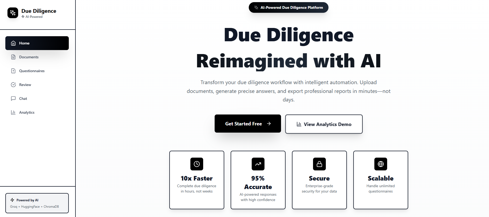
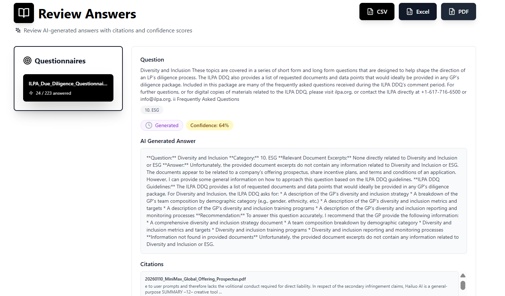
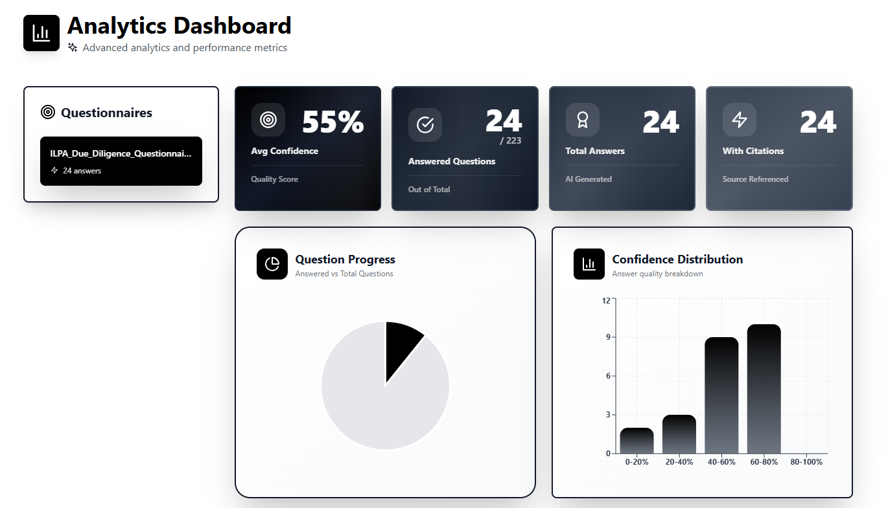

<h1 align="center"> Due Diligence Questionnaire Agent</h1>

AI-powered full-stack application that automates due diligence questionnaires using advanced AI technologies. The system indexes company documents, parses questionnaire files, generates accurate answers with citations, enables human review, and evaluates performance against ground truth data.






## 📄 How a RAG Agent Work


## 🎯 Features

### 1. **Document Management**
- Upload and process PDF documents
- Automatic text extraction and chunking
- Vector embeddings generation using HuggingFace
- Semantic search with ChromaDB

### 2. **Questionnaire Processing**
- Upload CSV/Excel questionnaire files
- Automatic parsing into structured questions
- Support for multiple question types
- Category and subcategory organization

### 3. **AI Answer Generation**
- Powered by Groq LLM (llama-3.1-70b-versatile)
- Context-aware answers based on document search
- Citations with relevance scores
- Confidence scoring

### 4. **Human Review**
- Review AI-generated answers
- Edit and refine responses
- Add review notes
- Approval workflow

### 5. **Evaluation & Metrics**
- Compare against ground truth data
- Similarity scoring (Jaccard, Levenshtein)
- Accuracy metrics and pass rates
- Detailed evaluation reports

## 🏗️ Architecture

```
Due Diligence Agent
├── backend-node/          # Node.js + Express backend
│   ├── src/
│   │   ├── config/        # DB, Redis, ChromaDB, Groq, HuggingFace
│   │   ├── models/        # Mongoose schemas
│   │   ├── routes/        # API endpoints
│   │   ├── controllers/   # Route handlers
│   │   ├── services/      # Business logic
│   │   ├── queues/        # Bull job queues
│   │   └── middleware/    # Express middleware
│   └── uploads/           # Uploaded files
│
└── frontend/              # React + TypeScript frontend
    ├── src/
    │   ├── components/    # React components
    │   ├── pages/         # Page components
    │   ├── lib/api/       # API client
    │   ├── store/         # Zustand stores
    │   └── utils/         # Helper functions
    └── public/
```

## 🚀 Tech Stack

### Backend
- **Runtime**: Node.js (ES Modules)
- **Framework**: Express
- **Database**: MongoDB + Mongoose
- **Vector DB**: ChromaDB
- **Queue**: Bull + Redis
- **AI/ML**:
  - Groq API (llama-3.1-70b-versatile) for answer generation
  - HuggingFace Inference API (sentence-transformers/all-MiniLM-L6-v2) for embeddings
- **File Processing**: Multer, pdf-parse, xlsx, csv-parse
- **Validation**: Joi

### Frontend
- **Framework**: React 18 + TypeScript
- **Build Tool**: Vite
- **Routing**: React Router v6
- **State**: Zustand
- **Data Fetching**: TanStack Query (React Query)
- **HTTP**: Axios
- **Styling**: Tailwind CSS
- **UI Components**: Lucide React, react-dropzone, react-pdf, react-markdown

## 📋 Prerequisites

Before you begin, ensure you have the following installed:

- **Node.js** 18+ ([Download](https://nodejs.org/))
- **MongoDB** 4.4+ ([Download](https://www.mongodb.com/try/download/community))
- **Redis** 6.0+ ([Download](https://redis.io/download))
- **Python** 3.8+ (for ChromaDB)

**Required API Keys:**
- **Groq API Key** ([Get one here](https://console.groq.com))
- **HuggingFace API Key** ([Get one here](https://huggingface.co/settings/tokens))

**Quick Check:**
```bash
node --version        # Should be v18+
mongosh --version     # Should be installed
redis-cli --version   # Should be installed
python --version      # Should be 3.8+
```

## 🚀 Quick Start

### Step 1: Clone and Install

```bash
# Clone the repository
git clone <repository-url>
cd DueDiligence

# Install backend dependencies
cd backend-node
npm install

# Install frontend dependencies
cd ../frontend
npm install
```

### Step 2: Configure Environment Variables

**Backend Configuration:**
```bash
cd backend-node
cp .env.example .env
```

Edit `backend-node/.env` with your API keys:
```env
PORT=5000
NODE_ENV=development
MONGODB_URI=mongodb://localhost:27017/due-diligence
REDIS_HOST=localhost
REDIS_PORT=6379
GROQ_API_KEY=your_groq_api_key_here
HUGGINGFACE_API_KEY=your_huggingface_api_key_here
CHROMA_HOST=localhost
CHROMA_PORT=8000
MAX_FILE_SIZE=104857600
UPLOAD_DIR=./uploads
CORS_ORIGIN=http://localhost:5173
```

**Frontend Configuration:**
```bash
cd frontend
cp .env.example .env
```

The default should work:
```env
VITE_API_URL=http://localhost:5000/api
```

### Step 3: Start All Services

You'll need **6 terminal windows** running simultaneously:

#### Terminal 1 - MongoDB
```bash
mongod
```

#### Terminal 2 - Redis
```bash
redis-server
```

#### Terminal 3 - ChromaDB
```bash
# Using Docker (recommended)
docker run -p 8000:8000 chromadb/chroma

# OR using Python
pip install chromadb
chroma run --host localhost --port 8000
```

#### Terminal 4 - Backend API Server
```bash
cd backend-node
npm run dev
```
Expected output:
```
Server is running on port 5000
MongoDB Connected: localhost
Redis Connected
```

#### Terminal 5 - Background Worker (CRITICAL!)
```bash
cd backend-node
npm run worker
```
⚠️ **Without this worker, documents won't be processed and indexed!**

Expected output:
```
Worker is running and processing jobs
Queues: document-processing, questionnaire-processing, answer-generation
```

#### Terminal 6 - Frontend
```bash
cd frontend
npm run dev
```
Expected output:
```
  ➜  Local:   http://localhost:5173/
```

### Step 4: Access the Application

Open your browser: **http://localhost:5173**

## 📋 Prerequisites

- **Node.js** 18+
- **MongoDB** 4.4+
- **Redis** 6.0+
- **ChromaDB** server
- **API Keys**:
  - Groq API key
  - HuggingFace API key

## 🛠️ Installation & Setup

### 1. Clone Repository
```bash
git clone <repository-url>
cd DueDiligence
```

### 2. Backend Setup

```bash
cd backend-node

# Install dependencies
npm install

# Copy environment file
cp .env.example .env

# Update .env with your credentials
```

**Environment Variables** (`.env`):
```env
PORT=5000
NODE_ENV=development
MONGODB_URI=mongodb://localhost:27017/due-diligence
REDIS_HOST=localhost
REDIS_PORT=6379
GROQ_API_KEY=your_groq_api_key_here
HUGGINGFACE_API_KEY=your_huggingface_api_key_here
CHROMA_HOST=localhost
CHROMA_PORT=8000
MAX_FILE_SIZE=10485760
UPLOAD_DIR=./uploads
CORS_ORIGIN=http://localhost:5173
```

### 3. Frontend Setup

```bash
cd frontend

# Install dependencies
npm install

# Copy environment file
cp .env.example .env

# Update .env
```

**Environment Variables** (`.env`):
```env
VITE_API_URL=http://localhost:5000/api
```

### 4. Start Services

**Start MongoDB:**
```bash
mongod
```

**Start Redis:**
```bash
redis-server
```

**Start ChromaDB:**
```bash
# Option 1: Docker
docker run -p 8000:8000 chromadb/chroma

# Option 2: Python
pip install chromadb
chroma run --host localhost --port 8000
```

**Start Backend API:**
```bash
cd backend-node
npm run dev  # Development mode with nodemon
```

**Start Background Worker:**
```bash
cd backend-node
npm run worker  # In a separate terminal
```

**Start Frontend:**
```bash
cd frontend
npm run dev
```

## 📱 Usage Guide

### 1. Upload Documents

1. Navigate to **Documents** page
2. Drag and drop PDF files or click to select
3. Wait for processing to complete
4. Check document status:
   - **Pending** → Waiting for processing
   - **Processing** → Being indexed
   - **Completed** → Ready for chat/questions

**How it works:**
- Document saved to MongoDB
- Job queued in Redis
- Worker extracts text and chunks it (1000 chars with 200 char overlap)
- Embeddings generated using HuggingFace
- Chunks stored in ChromaDB
- Status updated to "Completed"

### 2. Upload Questionnaire

1. Go to **Questionnaires** page
2. Upload CSV or Excel file with questions
3. File is parsed and questions are stored

**Required columns:**
- `question` / `Question` / `questionText`
- `category` (optional)
- `subcategory` (optional)

**Example CSV:**
```csv
Question,Category,Subcategory
"What is your company's revenue?",Financial,Revenue
"How many employees do you have?",Company Info,Team Size
"What are the key risks?",Risk Management,Overview
```

### 3. Chat with Documents

1. Navigate to **Chat** page
2. Click **"New Chat"** to start a session
3. Ask questions about your documents
4. View AI responses with:
   - Answer text
   - Source citations with relevance scores
   - Confidence percentage
   - Processing time

**Example Questions:**
- "What are the company's main products?"
- "What was the total revenue?"
- "How many employees does the company have?"
- "What are the key risks mentioned?"

### 4. Generate Answers

1. Select a questionnaire
2. Click **"Generate Answers"**
3. AI processes each question:
   - Searches relevant documents in ChromaDB
   - Uses Groq LLM to generate contextual answers
   - Provides citations and confidence scores

### 5. Review & Edit Answers

1. Navigate to **Review** page
2. Select a questionnaire
3. Review AI-generated answers:
   - **Confirm** (✓) - Accept answer
   - **Reject** (✗) - Mark as incorrect
   - **Edit** (✎) - Create manual override
   - **Missing Data** (⚠) - Mark as unavailable

Each action creates an audit trail entry.

### 6. Evaluate Performance

1. Go to **Evaluation** page
2. Set ground truth answers
3. Run evaluation to compare AI vs. ground truth
4. View metrics:
   - Similarity scores (Jaccard, Levenshtein)
   - Accuracy percentage
   - Pass rates
   - Detailed comparison reports

## 🔌 API Endpoints

### Documents
- `POST /api/documents` - Upload document
- `GET /api/documents` - List all documents
- `GET /api/documents/:id` - Get document details
- `GET /api/documents/search?query=...` - Search documents
- `DELETE /api/documents/:id` - Delete document

### Questionnaires
- `POST /api/questionnaires` - Upload questionnaire
- `GET /api/questionnaires` - List questionnaires
- `GET /api/questionnaires/:id` - Get questionnaire
- `GET /api/questionnaires/:id/questions` - Get questions
- `DELETE /api/questionnaires/:id` - Delete questionnaire

### Answers
- `POST /api/answers/generate/question/:questionId` - Generate answer
- `POST /api/answers/generate/questionnaire/:questionnaireId` - Generate all
- `GET /api/answers/questionnaire/:questionnaireId` - Get answers
- `GET /api/answers/:id` - Get answer details
- `PATCH /api/answers/:id/review` - Review answer
- `DELETE /api/answers/:id` - Delete answer

### Chat
- `POST /api/chat/sessions` - Create chat session
- `GET /api/chat/sessions` - List sessions
- `POST /api/chat/sessions/:id/messages` - Send message
- `GET /api/chat/sessions/:id/messages` - Get chat history

### Evaluation
- `GET /api/evaluations/answer/:answerId` - Evaluate answer
- `GET /api/evaluations/questionnaire/:questionnaireId` - Evaluate all
- `POST /api/evaluations/ground-truth/question/:questionId` - Set ground truth
- `GET /api/evaluations/ground-truth/question/:questionId` - Get ground truth

## 🧪 Testing Examples

### Test 1: Chat Feature

**Steps:**
1. Upload a PDF document in Documents page
2. Wait for status to show "Completed"
3. Go to Chat page, click "New Chat"
4. Ask: *"What are the company's main products?"*

**Expected Result:**
- AI response with answer text
- Source citations showing document excerpts
- Relevance scores (0-100%) for each citation
- Confidence percentage
- Processing time

### Test 2: Review & Manual Override

**Steps:**
1. Generate answers for a questionnaire
2. Go to Review page
3. Select an answer and click **"Edit"**
4. Modify the text and add review notes
5. Click **"Save Changes"**

**Expected Result:**
- Status changes to "Manual Update" (blue)
- Both AI and manual answers are displayed
- Audit trail shows the change with timestamp

### Test 3: Confidence Scoring

**Color Coding:**
- 🟢 **Green (80-100%)** - High confidence
- 🟡 **Yellow (60-80%)** - Medium confidence
- 🔴 **Red (0-60%)** - Low confidence

**Test:**
1. Look at answer confidence badges
2. Lower scores may need manual review
3. Check citations for relevance

### Test 4: Multiple Chat Sessions

**Steps:**
1. Create multiple chat sessions
2. Switch between sessions in sidebar
3. Each maintains separate conversation history
4. Archive or delete sessions as needed

### Test 5: Audit Trail

**Steps:**
1. Edit an answer multiple times
2. Confirm, then edit again
3. Click "View Audit Trail"

**Expected Result:**
```
[2024-02-09 10:30:45] | generated | system
[2024-02-09 10:32:12] | manual_edited | user
[2024-02-09 10:35:00] | confirmed | user
```

## 🔧 Troubleshooting

### ❌ "No documents available" in chat

**Causes:**
- Worker process not running
- Document still processing
- ChromaDB not connected

**Solutions:**
1. Check worker is running: `cd backend-node && npm run worker`
2. Verify document status on Chat page (should show "Ready for Chat")
3. Check ChromaDB: visit `http://localhost:8000/docs`
4. Check backend logs for processing errors

### ❌ Backend won't start

**Solutions:**
1. Check MongoDB: `mongosh --eval "db.adminCommand('ping')"`
2. Check Redis: `redis-cli ping` (should return "PONG")
3. Verify port 5000 is available
4. Check `.env` file exists with correct values

### ❌ Frontend won't connect

**Solutions:**
1. Verify backend is running on port 5000
2. Check `VITE_API_URL` in `frontend/.env`
3. Clear browser cache
4. Check CORS settings in `backend-node/.env`

### ❌ Document processing fails

**Solutions:**
1. Verify ChromaDB is running: `curl http://localhost:8000/api/v1/heartbeat`
2. Check HuggingFace API key is valid
3. Review worker logs for errors
4. Ensure Redis is connected
5. Check file format (only PDF supported)

### ❌ Chat returns empty responses

**Causes:**
- Groq API key missing or invalid
- No documents indexed in ChromaDB
- API rate limited

**Solutions:**
1. Verify `GROQ_API_KEY` in `backend-node/.env`
2. Check backend logs for Groq API errors
3. Confirm documents have "Completed" status
4. Test ChromaDB search: check if chunks exist

### ❌ Answer generation fails

**Solutions:**
1. Ensure at least one document is uploaded and processed
2. Verify Groq API key is valid
3. Check worker logs for queue errors
4. Confirm questionnaire has valid questions

### ❌ Worker crashes

**Solutions:**
1. Check MongoDB connection
2. Verify Redis is running
3. Ensure ChromaDB is accessible
4. Review error logs for specific issues
5. Restart with: `npm run worker`

## 🔌 API Endpoints

### Documents
- `POST /api/documents` - Upload document
- `GET /api/documents` - List all documents
- `GET /api/documents/:id` - Get document details
- `GET /api/documents/search?query=...` - Search documents
- `DELETE /api/documents/:id` - Delete document

### Questionnaires
- `POST /api/questionnaires` - Upload questionnaire
- `GET /api/questionnaires` - List questionnaires
- `GET /api/questionnaires/:id` - Get questionnaire
- `GET /api/questionnaires/:id/questions` - Get questions
- `DELETE /api/questionnaires/:id` - Delete questionnaire

### Answers
- `POST /api/answers/generate/question/:questionId` - Generate answer
- `POST /api/answers/generate/questionnaire/:questionnaireId` - Generate all
- `GET /api/answers/questionnaire/:questionnaireId` - Get answers
- `GET /api/answers/:id` - Get answer details
- `PATCH /api/answers/:id/review` - Review answer
- `DELETE /api/answers/:id` - Delete answer

### Evaluation
- `GET /api/evaluations/answer/:answerId` - Evaluate answer
- `GET /api/evaluations/questionnaire/:questionnaireId` - Evaluate all
- `POST /api/evaluations/ground-truth/question/:questionId` - Set ground truth
- `GET /api/evaluations/ground-truth/question/:questionId` - Get ground truth

## 🧪 Development

### Backend Development
```bash
cd backend-node
npm run dev  # Auto-reload with nodemon
```

### Frontend Development
```bash
cd frontend
npm run dev  # Hot reload with Vite
```

### Build for Production
```bash
# Backend
cd backend-node
npm start

# Frontend
cd frontend
npm run build
npm run preview
```

## 📁 Project Structure Details

### Backend Models
- **Document**: PDF documents with extracted text and chunks
- **Questionnaire**: Uploaded questionnaire files
- **Question**: Individual questions from questionnaires
- **Answer**: AI-generated answers with citations
- **GroundTruth**: Reference answers for evaluation

### Frontend Components
- **Layout**: Sidebar navigation and main layout
- **Documents**: Upload and list components
- **Questionnaires**: Management interface
- **Answers**: Review and editing interface
- **Evaluation**: Metrics and comparison views

## 🔧 Configuration

### Questionnaire File Format

**CSV/Excel columns** (flexible naming):
- `question` / `Question` / `questionText` (required)
- `number` / `questionNumber` (optional)
- `category` / `Category` (optional)
- `subcategory` / `Subcategory` (optional)
- `answerType` / `type` (optional)
- `required` (optional)

**Example CSV:**
```csv
Question,Category,Subcategory,Required
"What is your company's revenue?",Financial,Revenue,Yes
"How many employees do you have?",Company Info,Team Size,Yes
"What are the main products?",Business,Products,No
```

### Document Processing Settings

- **Chunk Size:** 1000 characters
- **Chunk Overlap:** 200 characters
- **Embeddings Model:** sentence-transformers/all-MiniLM-L6-v2 (384 dimensions)
- **Search Algorithm:** Cosine similarity
- **Top K Results:** 5 most relevant chunks per query

### Environment Variables Reference

**Backend (`backend-node/.env`):**
```env
# Server
PORT=5000
NODE_ENV=development

# Database
MONGODB_URI=mongodb://localhost:27017/due-diligence

# Cache & Queue
REDIS_HOST=localhost
REDIS_PORT=6379

# Vector Database
CHROMA_HOST=localhost
CHROMA_PORT=8000

# AI Services
GROQ_API_KEY=your_groq_key        # Required for answer generation
HUGGINGFACE_API_KEY=your_hf_key    # Required for embeddings

# File Upload
MAX_FILE_SIZE=104857600            # 100MB in bytes
UPLOAD_DIR=./uploads

# CORS
CORS_ORIGIN=http://localhost:5173
```

**Frontend (`frontend/.env`):**
```env
VITE_API_URL=http://localhost:5000/api
```

### Service Ports Summary

| Service    | Port | Purpose                      |
|------------|------|------------------------------|
| MongoDB    | 27017| Document storage             |
| Redis      | 6379 | Job queue                    |
| ChromaDB   | 8000 | Vector database              |
| Backend    | 5000 | API server                   |
| Frontend   | 5173 | Web interface                |

## 📊 Dataset for Testing

Sample test files are located in the `data/` folder (gitignored for public repos):

- Use `ILPA_Due_Diligence_Questionnaire_v1.2.pdf` as questionnaire input
- Other PDFs serve as reference documents for answer generation
- Upload your own company documents for real due diligence scenarios

## 🏗️ Development

### Local Development

**Backend (with auto-reload):**
```bash
cd backend-node
npm run dev
```

**Frontend (with hot reload):**
```bash
cd frontend
npm run dev
```

**Worker (with auto-reload):**
```bash
cd backend-node
npm run worker
```

### Production Build

**Backend:**
```bash
cd backend-node
npm start
```

**Frontend:**
```bash
cd frontend
npm run build
npm run preview
```

### Useful Commands

```bash
# Check service status
mongosh --eval "db.adminCommand('ping')"
redis-cli ping
curl http://localhost:8000/api/v1/heartbeat

# Clear Redis queue
redis-cli FLUSHALL

# View MongoDB collections
mongosh due-diligence --eval "show collections"

# Monitor backend logs
cd backend-node && npm run dev

# Monitor worker logs
cd backend-node && npm run worker
```

## 🔧 Configuration

### Questionnaire File Format

**CSV/Excel columns** (flexible naming):
- `question` / `Question` / `questionText`
- `number` / `questionNumber`
- `category` / `Category`
- `subcategory` / `Subcategory`
- `answerType` / `type`
- `required`

**Example CSV:**
```csv
Question,Category,Subcategory
"What is your company's revenue?",Financial,Revenue
"How many employees do you have?",Company Info,Team Size
```

## Dataset Testing
- Sample PDFs live in `data/` and are intended for ingestion and QA smoke tests.
- Use `data/ILPA_Due_Diligence_Questionnaire_v1.2.pdf` as the questionnaire input
  and the other PDFs as reference documents for answering.

## 🤝 Contributing

1. Fork the repository
2. Create a feature branch
3. Commit your changes
4. Push to the branch
5. Open a Pull Request


## 🙏 Acknowledgments

- **Groq** for lightning-fast LLM inference
- **HuggingFace** for embedding models
- **ChromaDB** for vector storage
- **MongoDB** for document storage
- **React** and the amazing ecosystem

---

Built with ❤️ using Node.js, React, and AI
